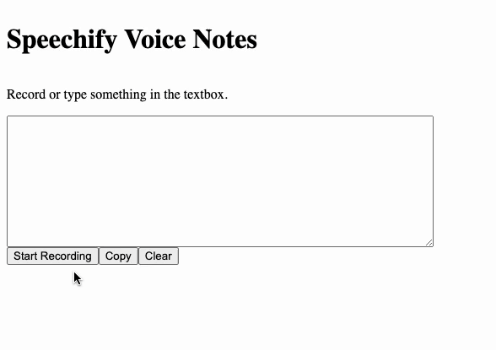

# Voice Notes Web App Test

This test aims to assess your ability to create a voice notes web application that utilizes real-time audio streaming and transcription. The task involves implementing a user-friendly interface where users can record their voice, view their live transcription, edit their transcription, and copy or clear it as needed.



## Task Details

### Implementation Checklist

- [ ] **Stream Audio:** Stream the recorded audio to the server for real-time transcription using WebSocket (Socket.IO) library.
- [ ] **Live Transcription:** Implement real-time transcription of the user's voice using Deepgram Transcription API.
- [ ] **Display Transcription:** Display the live transcription in a text area, allowing the user to see what they are saying in real-time.
- [ ] **Edit Transcription:** Allow the user to manually edit the transcription in the text area.
- [ ] **Copy Transcription:** Add a copy button that allows the user to easily copy the transcription to the clipboard.
- [ ] **Clear Transcription:** Add a clear button that resets the transcription and clears the text area.
- [ ] **Create Attractive UI:** Design and implement a visually appealing and intuitive user interface for the web app.

### Transcription API Integration

- The web app should integrate with Deepgram Transcription API to perform real-time transcription of the user's voice.
- The server-side implementation should handle the communication with the transcription API, including sending the audio stream and receiving transcription events.
- The client-side implementation should display the transcription events in real-time as they are received from the server.

### Audio Streaming with WebSocket (Socket.IO)

- Use the WebSocket (Socket.IO) library to establish a real-time bidirectional communication channel between the client and the server.
- Utilize the WebSocket connection to stream the recorded audio from the client to the server in real-time.
- The server should receive the audio stream and forward it to the transcription API for real-time transcription.

### UI Design

- The UI should be designed to match the look and feel of the Speechify website.
- Use similar colors, theming, and visual elements to create a consistent user experience.
- Be creative in your implementation and feel free to add your own unique touch to the UI while staying true to the Speechify brand.
- The implementation of the UI is flexible, so you have the freedom to make design decisions that enhance the user experience and functionality of the web app.

### Provided Code

- We provide the `useAudioRecorder` file to handle the audio recording events.
- The `useAudioRecorder` file abstracts away the complexity of audio recording, allowing you to focus on streaming the audio and implementing the transcription features.

## Setup

- Clone the repository.
- Navigate to the client directory and run the following commands:
  ```
  cd client
  npm install
  npm run dev
  ```
- In a separate terminal window, navigate to the server directory and run the following commands:
  ```
  cd server
  npm install
  npm run dev
  ```

### Server-side Implementation

- Implement the server-side logic to handle the WebSocket connection and audio streaming.
- Use the Socket.IO library to establish a WebSocket connection between the client and the server.
- Receive the audio stream from the client via the WebSocket connection and send it to the transcription API for real-time transcription.
- Subscribe to the transcription events provided by the API and emit them to the client via the WebSocket connection.

### Client-side Implementation

- Utilize the provided `useAudioRecorder` file to handle audio recording events.
- Implement the client-side logic to establish a WebSocket connection with the server using the Socket.IO library.
- Stream the recorded audio to the server via the WebSocket connection in real-time.
- Listen for transcription events emitted by the server:
  - Display the interim transcription results in the text area as they are received, allowing the user to see the real-time transcription progress.
  - When the final transcription results are received, replace the interim results in the text area with the final transcription.
- Allow the user to manually edit the transcription in the text area.
- Implement a copy button that allows the user to easily copy the transcription to the clipboard.
- Add a clear button that resets the transcription and clears the text area.

## Automatic Testing

To facilitate testing of the web app, please make sure to add the following IDs to the corresponding UI components:

- Record Button: Add the ID `record-button` to the button element that starts and stops the audio recording.
  Example: `<button id="record-button">Record</button>`

- Transcription Display: Add the ID `transcription-display` to the element that displays the real-time transcription.
  Example: `<textarea id="transcription-display"></textarea>`

- Copy Button: Add the ID `copy-button` to the button element that copies the transcription to the clipboard.
  Example: `<button id="copy-button">Copy</button>`

- Clear Button: Add the ID `reset-button` to the button element that clears the transcription.
  Example: `<button id="reset-button">Clear</button>`

By adding these IDs to the respective UI components, the provided test suite will be able to locate and interact with the elements correctly.

---

## Development Guidelines

### Do's

- Write clean, maintainable, and well-documented code and follow the best practices and coding standards.
- You are free to use any official documentation or language references (MDN, React Docs, Socket.IO Docs, etc).
- You can use the debugging tools and native IDE features (only standard Auto-Completion).
- Implement robust error handling and graceful error recovery mechanisms throughout the application to ensure a smooth user experience and maintain the stability of the web app.

### Don'ts

- Do NOT use any external libraries for the implementation, except for any previously mentioned or already installed sdks.
- DO NOT include any API keys or sensitive information in the client-side code.
- DO NOT use any Coding Assistants like GitHub Copilot, ChatGPT, etc., or any other AI-based tools.
- DO NOT visit direct blogs or articles related to the implementation of the tasks.
- DO NOT use Stack Overflow or any other forum websites.
- DO NOT submit your Deepgram key in your final solution (keep in .env file). We will use our own when auto-grading.

## Resources

- Socket IO documentation: https://socket.io/docs/v4/
- Socket IO client sdk: https://www.npmjs.com/package/socket.io-client
- Socket IO server sdk: https://www.npmjs.com/package/socket.io-client
- Deepgram documentation: https://developers.deepgram.com/docs/node-sdk-streaming-transcription
- Deepgram sdk: https://www.npmjs.com/package/@deepgram/sdk
- Deepgram signup (for free API key): https://console.deepgram.com/signup
